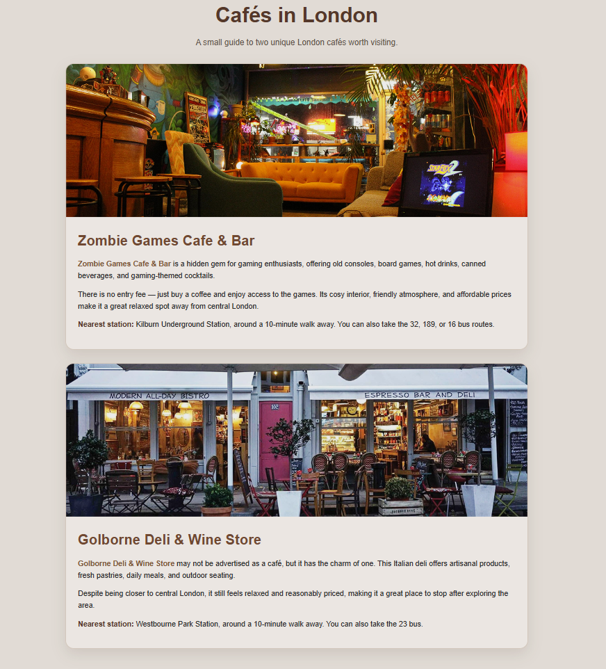

# ☕ London Cafés Guide

A simple website created as part of a university web development module, showcasing two unique cafés in London. The project focuses on semantic HTML, responsive design, and clean presentation of information.

## 📖 Overview

The website highlights:

* Zombie Games Cafe & Bar
* Golborne Deli & Wine Store

Each café includes information about its atmosphere, location, and nearby transport options.

---

## ✨ Features

* Responsive design
* Modern card-based layout
* Café descriptions and travel information
* Image galleries
* Clean semantic HTML structure

---

## 🛠️ Technologies Used

* HTML5
* CSS3

---

## 📸 Screenshot

Add a screenshot of the homepage here:

```md

```

---

## 📂 Project Structure

```text
cafes.html
styles.css
media/
├── cafe1.jpg
└── cafe2.jpg
```

---

## 🎓 What I Learned

Through this project I practiced:

* Semantic HTML
* CSS layouts and styling
* Responsive design principles
* Website structure and asset organisation

---

## 🚀 Future Improvements

* Multi-page navigation
* Interactive map integration
* Additional café recommendations
* Accessibility improvements
* Dark mode support

---

## 👨‍💻 Author

**Sebastian Restrepo**

BSc Computing Student
Birkbeck, University of London

---

## 🔗 Repository

Feel free to explore the code and provide feedback.
